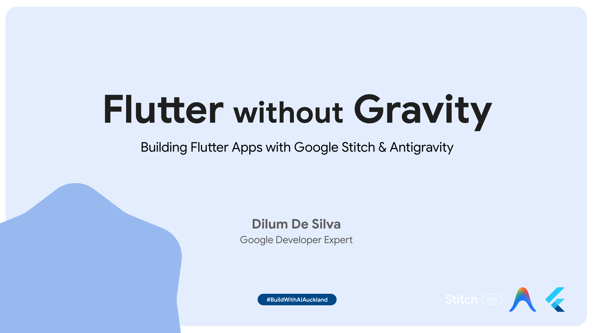

<p align="center">
  
</p>

<p align="center">
  <a href="https://dilumdesilva.dev/docs/flutter_without_gravity.pdf"></a>
</p>

<p align="center">
  <a href="https://github.com/dilumdesilva/flutter-without-gravity/blob/main/talk-assets/redeem_cloud_credits.pdf"></a>
</p>


## Tech Stack & Resources

| Tool | Description | Link |
|------|-------------|------|
| **Flutter** | Google's cross-platform UI framework | [flutter.dev](https://flutter.dev) |
| **FVM** | Flutter Version Management — manage multiple Flutter SDK versions per project | [fvm.app](https://fvm.app) |
| **Google Stitch** | AI-powered UI design tool from Google Labs — describe your UI in words, get polished designs | [stitch.withgoogle.com](https://stitch.withgoogle.com) |
| **Google Antigravity** | Agent-first IDE (VS Code fork) powered by Gemini — agents read/write code, run commands, and verify output | [antigravity.google](https://antigravity.google) |

### Additional Resources

- **Stitch MCP Skills** — [github.com/google-labs-code/stitch-skills](https://github.com/google-labs-code/stitch-skills)
- **What is MCP (Model Context Protocol)?** — [cloud.google.com/discover/what-is-model-context-protocol](https://cloud.google.com/discover/what-is-model-context-protocol)

---

## Prerequisites

1. Install [FVM](https://fvm.app) and set up the Flutter SDK version for this project
2. Install [Google Antigravity IDE](https://antigravity.google)
3. Set up a [Google Stitch](https://stitch.withgoogle.com) account
4. Configure the Stitch MCP server in Antigravity (MCP Servers settings):

   ```json
   {
     "mcpServers": {
       "stitch": {
         "serverUrl": "https://stitch.googleapis.com/mcp",
         "headers": {
           "X-Goog-Api-Key": "YOUR-API-KEY"
         }
       }
     }
   }
   ```
5. Android emulator or iOS simulator ready

---

## Demo Prompts

### Stitch Prompts

**S1 — Home Screen Design**

```
You are a UI/UX designer specializing in modern mobile app design.
Design the home screen for a tech events app called AKL Tech, built
for the Auckland, New Zealand developer community to discover local
meetups, conferences, and workshops. The screen should have a greeting
header saying "What's happening in AKL" with a search bar at the top,
followed by a horizontal scrollable "Upcoming Events" section with
event cards showing event name, date, venue name, and a tech-themed
thumbnail image. Below that, a "Speakers in Town" section with
circular avatar cards of international speakers showing their name
and talk topic underneath. Then a "Hot Topics" section with rounded
tag chips: AI, Flutter, Cloud, DevOps, Cybersecurity, Web3, Mobile.
The overall vibe should feel sleek and developer-friendly — use a
dark navy (#0A1628) and electric blue (#2979FF) color palette with
white card surfaces and subtle card shadows for depth.
```

**S2 — Refine Designs**

```
You are a UI/UX designer who excels at visual hierarchy and
scannability. Refine the existing AKL Tech home screen design to
make event types instantly recognizable and the cards more visually
prominent. Users browsing the app should be able to identify whether
an event is a meetup, conference, or workshop at a glance. Make the
event cards taller with more rounded corners (16px radius) and add a
subtle blue glow shadow effect. Add a small colored category badge in
the top-left corner of each event card — green for "Meetup", purple
for "Conference", orange for "Workshop". Make the speaker avatar
circles slightly larger and add a thin electric blue border ring
around them. The vibe should stay consistent with the dark navy and
electric blue palette but feel richer and more layered.
```

**S3 — Additional Refinement (Optional)**

```
You are a UI/UX designer focused on engagement and social proof.
Continue refining the AKL Tech home screen to make it feel more
alive and interactive. Users are more likely to attend events when
they see others are going too. Add a small attendee count with a
people icon on each event card (e.g., "127 attending"). Make the hot
topic chips have a subtle gradient fill in their default state so
they look tappable. The overall vibe should feel premium and polished
with more depth in the card shadows and generous spacing.
```

---

### Antigravity Prompts

**A1 — Initial App Build**

```
You are a senior Flutter developer who writes clean, maintainable
code. Use the Stitch MCP server to pull my AKL Tech designs and
create a Flutter app that brings them to life. The app is a tech
events hub for Auckland developers to browse upcoming meetups,
conferences, and workshops. Build the home screen with a greeting
header and search bar, a horizontal scrollable "Upcoming Events"
section with event cards, a "Speakers in Town" section with circular
speaker avatars, and a "Hot Topics" section with tag chips. Use clean
architecture with separate folders for models, screens, widgets, and
services. Use Material 3 theming with the dark navy (#0A1628) and
electric blue (#2979FF) palette from the designs. Use mocked data for
all events, speakers, and topics — include at least 8 events, 6
speakers, and 7 topic tags with realistic Auckland venue names and
tech event titles. The app should feel polished from first launch —
add shimmer loading states for each section and match the Stitch
layout exactly. Use my Stitch designs as reference.
```

**A2 — Bottom Nav + Speakers Tab**

```
You are a senior Flutter developer who builds intuitive navigation
patterns. Add a bottom navigation bar with two tabs: "Events" (home
icon) and "Speakers" (people icon). The Events tab is the existing
home screen. The Speakers tab should show a full scrollable list of
all international speakers with their circular photo, name, company,
talk title, and a short bio. Users should be able to browse speakers
independently from events and tap a speaker card to see a brief
bottom sheet with their full details. Keep the styling consistent
with the existing dark navy and electric blue theme so both tabs
feel like part of the same app.
```

**A3 — Search & Filter**

```
You are a senior Flutter developer who prioritizes responsive user
interactions. Add a working search feature to the Events tab that
filters event cards by event name and topic in real time as the user
types. Developers attending multiple meetups need to find specific
events quickly without scrolling. Show a friendly "No events found"
empty state with an illustration if nothing matches. The filtering
should feel instant and smooth — add a subtle fade animation as
cards filter in and out.
```

**A4 — Hot Topics Tap Filter**

```
You are a senior Flutter developer who builds interactive, tactile
UI components. Make the hot topic chips on the home screen tappable
so they filter the events list to show only events matching that
topic. Users browsing by interest (e.g., "AI" or "Flutter") should
see results instantly. The selected chip should visually change to a
filled/highlighted state, and tapping it again deselects and shows
all events. The filtering should feel alive and responsive — add a
smooth list animation when events filter in and out.
```

**A5 — Polish & Countdown Badges**

```
You are a senior Flutter developer who sweats the small details that
make apps feel professional. Add pull-to-refresh on the events list
with a custom refresh indicator matching the dark navy theme. Add a
countdown badge on each event card showing relative time — "Today",
"Tomorrow", "In 3 days", "Next week" — based on the event date.
Developers checking the app want to know at a glance which events
are coming up soonest. Style the badge as a small rounded chip in
the top-right corner of the card — it should catch the eye without
cluttering the layout.
```

**A6 — Build for Mobile**

```
You are a senior Flutter developer preparing an app for distribution.
Build a release APK for Android with proper app branding. The app
icon and splash screen should use the AKL Tech identity with the
dark navy background and the app name prominently displayed. The
splash screen should feel seamless — when a user opens the app, the
transition from splash to home screen should feel like one continuous
dark navy and electric blue experience.
```

---

## License

This project is part of the "Flutter without Gravity" talk demo.
